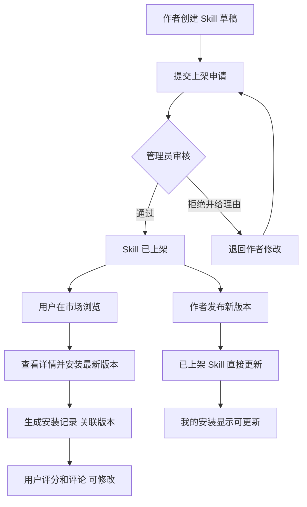

# SkillsOps 产品交互文档（PRD + 交互稿）

基于 `doc/需求文档.md` 输出，覆盖产品、交互、视觉三层，面向 V1 落地评审。

## 0. 范围与前提

- 范围包含：认证、市场浏览、详情安装、评分评价、作者发布与版本、管理员审核与运营管理。
- 不包含：企业 OpenID、支付体系、外部公开市场。
- 数据时效：详情页安装量、平均评分在写入后 `<=5s` 内刷新；榜单与趋势允许秒级最终一致。
- 角色：`USER/ADMIN` 两类全局角色；作者能力通过资源归属（`author_id`）判定，不单独设 `AUTHOR` 角色。

### 评审冻结结论

- 注册不要求邮箱验证码，采用“账号+密码”。
- 评分允许“仅打分不评论”。
- 安装不直接执行本地脚本；点击安装仅复制命令，用户自行在终端执行。
- 安装命令禁止携带长期明文 Token，改为短时签名安装链接（signed-git-url，短 TTL、单次可用）。
- 运营统计粒度支持日/周/月，默认提供近 7 天与近 30 天。
- 市场不展示未审核 Skill，仅上架后可见。
- 下架后已安装用户可查看，但不可安装任何历史版本。

---

## 1. 需求分析层（产品专家）

### 1.1 核心目标

- 解决问题：把分散的团队 Skill 资产统一“可发现、可判断、可安装、可迭代、可运营”。
- 目标人群：
  - 使用者：快速找到高质量 Skill 并安装。
  - 作者：低成本发布并持续更新版本。
  - 管理员：控制上架质量并观察运营价值。
- 关键结果（V1）：
  - 市场检索到安装的核心路径可在 3 步内完成。
  - Skill 生命周期可追踪（草稿/审核中/已上架/已下架）。
  - 安装、评分、版本更新数据可回流至运营面板。

### 1.2 用户画像

- 普通使用者（业务/研发）
  - 特征：任务驱动、时间紧、偏结果导向。
  - 场景：临时需要自动化能力，优先找“可直接用”的 Skill。
  - 痛点：找不到、看不懂、担心不稳定、版本不清楚。
- 作者（研发/效率工具维护者）
  - 特征：有复用意识，愿意沉淀工具。
  - 场景：将脚本产品化，发布新版本并获取反馈。
  - 痛点：上架路径不清晰、审核反馈慢、更新触达弱。
- 管理员（平台治理/团队负责人）
  - 特征：关注合规、质量和投入产出。
  - 场景：审核上架申请、下架违规、观察趋势与热点。
  - 痛点：待审积压、缺少统一指标、分类维护成本高。

### 1.3 功能清单（MoSCoW）

- Must have（P0）
  - 注册、登录、退出（HttpOnly Cookie 会话）。
  - 市场列表：分类/关键词/排序/分页。
  - Skill 详情：信息、版本历史、评价列表、安装。
  - 作者发布：创建 Skill、编辑、提交上架、发布新版本。
  - 管理员审核：通过/拒绝（拒绝理由必填）、下架。
  - 权限控制：仅作者本人和管理员可编辑。
- Should have（P1）
  - 评分与评论（1-5 分，一人一评可修改）。
  - 我的安装列表（包含版本与更新提示）。
  - 分类标签管理（新增、编辑、停用）。
  - 运营统计基础卡片（总数、趋势、热门、活跃作者）。
- Nice to have（P2）
  - 批量审核。
  - 安装后引导（使用文档快捷入口）。
  - 评分质量治理（低质量评论提醒）。
  - 消息中心（版本更新订阅提醒）。

### 1.4 业务流程图



### 1.5 异常场景（边界/错误/权限）

- 认证异常
  - Token 过期：弹出登录失效提示，跳转登录；登录后回原页面。
  - 未登录访问详情安装/工作台：拦截并引导登录。
- 权限异常
  - 非作者编辑他人 Skill：隐藏编辑入口；直链访问返回 403 页面。
  - 普通用户访问管理员页：隐藏导航；URL 访问提示“无权限”。
- 数据冲突
  - 审核中 Skill 被作者尝试编辑：阻止编辑并提示“审核中不可编辑，请等待审核结果”。
  - 发布版本号重复：阻止提交并提示“版本号已存在”。
  - 评分时发现未安装：阻止提交并提示“请先安装后评分”。
- 资源状态变化
  - Skill 已下架：市场不可见；已安装用户在“我的安装”仍可见并标注“已下架”。
  - 详情浏览中被下架：详情页显示下架状态，禁用安装和新评分。
- 系统错误
  - 列表/详情加载失败：显示错误态与重试按钮，保留筛选条件。
  - 安装失败：展示失败原因（可重试/联系作者）并记录失败日志。

---

## 2. 信息架构层（交互专家）

### 2.1 页面地图（Page Map）

- 一级页面
  - 认证
    - 登录
    - 注册
  - Skill 市场
    - 列表页
    - 详情页
  - 个人工作台
    - 我的发布（作者）
    - 我的安装（用户）
  - 管理后台（管理员）
    - 待审核列表
    - 分类管理
    - 运营统计

### 2.2 用户流程（主流程 + 分支）

- 主流程 A：发现并安装
  - 登录 -> 市场筛选搜索 -> 进入详情 -> 安装 -> 成功反馈 -> 进入“我的安装”。
- 分支 A1：安装失败
  - 安装 -> 失败提示 -> 查看错误原因 -> 重试或返回详情。
- 主流程 B：作者发布并上架
  - 工作台“我的发布” -> 创建 Skill -> 提交审核 -> 审核通过 -> 市场可见。
- 分支 B1：审核拒绝
  - 审核拒绝 -> 查看理由 -> 编辑修正 -> 再次提交审核。
- 主流程 C：已安装后评分
  - 我的安装/详情 -> 评分评论 -> 提交 -> 评分更新。
- 分支 C1：重复评分
  - 再次评分 -> 弹出“更新评分”确认 -> 覆盖旧评分。

### 2.3 页面结构与内容优先级

- 市场列表（任务优先：发现）
  - P0：筛选与搜索、排序、列表卡片、分页。
  - P1：推荐位/空态引导。
- 详情页（任务优先：决策与执行）
  - P0：标题区、安装区、版本信息、评分摘要。
  - P1：版本历史、评论列表、作者信息。
  - P2：相关 Skill 推荐。
- 工作台（任务优先：管理）
  - 作者：我的发布（状态、编辑、发布版本）。
  - 用户：我的安装（版本、更新、下架标记）。
  - 管理员：待审核、分类管理、运营统计。

### 2.4 交互规则（覆盖正常 + 异常）

- 状态变化
  - Loading：列表骨架屏（8 条占位）；详情骨架屏（主栏+侧栏）。
  - Empty：
    - 市场无结果：文案“未找到匹配 Skill”，按钮“清空筛选”“去发布”。
    - 我的发布为空：文案“还没有发布 Skill”，按钮“创建 Skill”。
  - Error：
    - 网络错误：文案+错误码+重试按钮。
    - 权限错误：403 状态页，返回首页按钮。
  - Success：
    - 安装成功、评分成功、提交审核成功统一 Toast（3s 自动消失）。
- 手势/操作反馈
  - Button 点击后 150ms 内进入 loading；防重复点击。
  - 输入框失焦触发表单校验；提交时全量校验。
  - 分页/筛选变更后回到列表顶部。
- 弹窗/跳转逻辑
  - 下架 Skill：二次确认弹窗，需输入“下架原因”。
  - 审核拒绝：弹窗必填“拒绝理由”（10-200 字）。
  - 未登录触发受限操作：弹出登录弹窗或跳登录页（保留 returnUrl）。
  - 发布新版本成功：停留当前页并刷新版本列表；不跳转。

---

## 3. 视觉规范层（UI 视觉专家）

### 3.1 布局网格

- 设计基准：Desktop First，1440px 画板。
- 页面安全边距：左右 `24px`（>=1200px）；窄屏降为 `16px`。
- 主内容区最大宽度：`1200px`，居中对齐。
- 栅格系统：12-column，gutter `16px`。
- 详情页分栏：左 8 列（内容），右 4 列（操作栏）。
- 卡片列表：3 列（>=1280px），2 列（1024-1279px），1 列（<1024px）。

### 3.2 色彩体系（含色值）

- 主色（Primary）
  - `#2F6BFF`：主按钮、当前导航、关键链接。
  - `#1F4FD6`：Primary Hover。
  - `#163CA8`：Primary Active。
- 辅助色（Secondary）
  - `#7C3AED`：辅助强调（如“新版本”Tag）。
- 功能色（Semantic）
  - Success：`#16A34A`（通过、成功）。
  - Warning：`#F59E0B`（风险提醒、待处理）。
  - Danger：`#DC2626`（错误、拒绝、下架）。
  - Info：`#0284C7`（信息提示）。
- 中性色（Neutral）
  - `#111827` 主文本
  - `#374151` 次级文本
  - `#6B7280` 辅助文本
  - `#D1D5DB` 边框/分割线
  - `#F3F4F6` 背景浅灰
  - `#FFFFFF` 卡片背景

### 3.3 字体规范

- 字体族：`Inter`, `PingFang SC`, `Microsoft YaHei`, sans-serif。
- 字号层级
  - H1：`32px` / `40px` / 600
  - H2：`24px` / `32px` / 600
  - H3：`20px` / `28px` / 600
  - Body-L：`16px` / `24px` / 400
  - Body-M：`14px` / `22px` / 400
  - Caption：`12px` / `18px` / 400
  - Label：`12px` / `16px` / 500

### 3.4 组件规范（关键）

- 按钮
  - 高度：Large `40px`，Medium `36px`，Small `32px`。
  - 圆角：`8px`。
  - 内边距：`0 16px`（M）。
  - 状态：Default/Hover/Active/Disabled/Loading。
- 输入框
  - 高度：`40px`；边框 `1px` `#D1D5DB`；聚焦边框 `#2F6BFF`。
  - 错误态边框：`#DC2626`；错误文案 `12px`。
- Skill 卡片
  - 最小高：`220px`；圆角 `12px`；边框 `1px` `#E5E7EB`。
  - 卡片内边距：`16px`；模块间距：`12px`。
  - 描述最多 2 行，超出省略。
- 列表项
  - 行高：`56px`（标准）；hover 背景 `#F9FAFB`。
- Tag
  - 高度：`24px`；水平内边距 `8px`；圆角 `999px`。

### 3.5 间距体系

- 基础单位：`8px`（4px 可用于微调）。
- 推荐组合：
  - 区块与区块：`24px` / `32px`
  - 标题与内容：`16px`
  - 表单项之间：`12px`
  - 组件内边距：`16px`
  - 页面上下留白：`24px`（移动端 `16px`）

---

## 4. 页面详述（逐页）

### 页面名称：登录/注册页

- **页面目的**：完成用户认证，建立访问权限。
- **入口来源**：未登录访问受限页面；用户主动点击“登录/注册”。
- **核心模块**：
  1. 认证切换区：登录/注册 Tab，切换保留已填字段。
  2. 表单区：账号、密码（注册增加确认密码）。
  3. 辅助区：错误提示、找回入口（待确认）。
- **交互说明**：
  - 点击“登录” -> 校验通过后进入 `Skill 市场`。
  - 登录失败 -> 顶部错误提示 + 字段高亮。
  - 注册成功 -> Toast + 自动跳转登录态。
- **空态/异常**：
  - 字段为空/格式错误 -> 字段下方即时错误。
  - Token 失效 -> 登录页显示“会话已过期”。
- **视觉备注**：表单卡片宽 `420px`，垂直居中；主按钮全宽。

### 页面名称：Skill 市场页

- **页面目的**：高效发现可安装 Skill。
- **入口来源**：登录成功默认进入；顶部导航进入。
- **核心模块**：
  1. 筛选条：分类、关键词、排序、重置。
  2. Skill 列表：卡片信息（名称/评分/安装量/版本/作者）。
  3. 分页区：页码与总条数。
- **交互说明**：
  - 输入关键词后回车 -> 更新列表并重置到第 1 页。
  - 点击卡片或“查看详情” -> 跳转详情页。
  - 切换排序 -> 保留其他筛选条件。
- **空态/异常**：
  - 无结果 -> “清空筛选”“创建 Skill”双 CTA。
  - 接口失败 -> 错误插画 + “重试”按钮。
- **视觉备注**：筛选条吸顶；卡片 3 列栅格布局，评分星标右上角突出。

### 页面名称：Skill 详情页

- **页面目的**：完成安装决策、安装执行、评分反馈。
- **入口来源**：市场列表、我的安装、我的发布。
- **核心模块**：
  1. 基础信息区：名称、标签、作者、当前版本、描述。
  2. 操作侧栏：安装按钮、安装状态、评分入口（吸顶）。
  3. 版本历史：版本号、发布时间、更新说明。
  4. 评论区：平均分、评论列表、我的评分编辑。
- **交互说明**：
  - 点击“复制安装命令” -> 将 `npx skills add <signed-git-url>` 复制到剪切板，用户自行在终端执行。
  - 复制成功后提示：`安装命令已复制，命令中含有您的 API Token，请勿直接分享给他人`。
  - 已安装用户评分 -> 提交后立即刷新均分和评论。
  - 管理员操作（上架审核/下架） -> 弹窗确认后执行。
- **空态/异常**：
  - 下架状态 -> 展示“已下架”Banner，禁用安装。
  - 非安装用户评分 -> 引导先安装。
- **视觉备注**：左右分栏比例约 7:3；操作侧栏顶部固定，关键按钮使用 Primary。

### 页面名称：我的发布（工作台-作者）

- **页面目的**：管理作者发布资产与状态。
- **入口来源**：顶部“工作台”默认子页。
- **核心模块**：
  1. 列表区：Skill 名称、状态、当前版本、更新时间。
  2. 操作区：新建、编辑、提交审核、发布新版本。
  3. 审核反馈区：拒绝原因与修订建议。
- **交互说明**：
  - 点击“新建 Skill” -> 进入 Skill 编辑页。
  - 创建/编辑表单中“资源地址（仓库地址/文档链接）”为单字段且必填，未填写不可提交。
  - 点击“提交审核” -> 状态切换为“审核中”。
  - 审核中状态 -> 编辑入口禁用并展示“审核中不可编辑”提示。
  - 点击“发布新版本” -> 弹窗填写版本号与更新说明。
- **空态/异常**：
  - 无发布记录 -> 引导创建第一个 Skill。
  - 版本号冲突 -> 阻断提交并显示错误。
- **视觉备注**：列表操作按钮采用 Text Button，主动作“新建”置于右上。

### 页面名称：我的安装（工作台-用户）

- **页面目的**：查看已安装 Skill 及更新状态。
- **入口来源**：工作台二级导航“我的安装”。
- **核心模块**：
  1. 安装列表：安装版本、当前最新版本、更新时间。
  2. 快捷动作：查看详情、复制最新安装命令。
- **交互说明**：
  - 点击“查看详情” -> 跳转详情页并定位版本信息。
  - 点击“复制安装命令” -> 复制短时签名链接命令，不自动执行。
  - 有新版本时显示“可更新”标识。
- **空态/异常**：
  - 空态 -> 引导返回市场。
  - Skill 已下架 -> 保留记录并打“已下架”Tag，禁用安装相关动作。
- **视觉备注**：状态 Tag 优先可视（可更新/已下架）。

### 页面名称：待审核（工作台-管理员）

- **页面目的**：完成上架审核闭环，保障内容质量。
- **入口来源**：管理员工作台。
- **核心模块**：
  1. 待审列表：提交人、提交时间、Skill 摘要。
  2. 审核操作：通过、拒绝。
  3. 拒绝理由弹窗：必填文本。
- **交互说明**：
  - 点击“通过” -> 状态改为已上架，市场立即可见。
  - 点击“拒绝” -> 弹窗填写理由后退回作者。
- **空态/异常**：
  - 无待审 -> 显示“当前无待处理项”。
  - 审核提交失败 -> 保留输入理由并可重试。
- **视觉备注**：通过按钮 Success，拒绝按钮 Danger；高风险动作颜色明确区分。

### 页面名称：运营统计（工作台-管理员）

- **页面目的**：评估平台使用效果并指导运营投入。
- **入口来源**：管理员工作台。
- **核心模块**：
  1. 指标卡片：Skill 总数、安装总量、活跃作者数。
  2. 趋势区：安装趋势（近 7/30 天）。
  3. 排行区：热门 Skill Top N。
- **交互说明**：
  - 切换时间范围 -> 所有指标联动刷新。
  - 点击热门 Skill -> 跳转详情页。
- **空态/异常**：
  - 无数据 -> 展示“暂无统计数据”。
  - 统计接口异常 -> 局部错误，不影响其他模块。
- **视觉备注**：卡片区采用 3-4 列等宽布局，趋势区优先占宽。

### 页面名称：分类管理（工作台-管理员）

- **页面目的**：维护市场分类结构，提升检索效率。
- **入口来源**：管理员工作台。
- **核心模块**：
  1. 分类列表：名称、使用中 Skill 数、状态（启用/停用）。
  2. 操作区：新增、编辑、停用。
- **交互说明**：
  - 停用分类 -> 二次确认，不影响历史数据展示。
  - 新增/编辑成功 -> 列表即时刷新。
- **空态/异常**：
  - 无分类 -> 引导新增首个分类。
  - 分类名重复 -> 阻断提交并提示。
- **视觉备注**：停用操作采用 Warning 风格，非主按钮。

---

## 5. 原型描述（文本线框图）

### 5.1 市场页线框（关键路径）

```text
+--------------------------------------------------------------------------------------------------+
| TopNav (100%w, 64h): Logo | 市场 | 工作台 | 管理(按角色) | 用户菜单                              |
|--------------------------------------------------------------------------------------------------|
| FilterBar (100%w, 56h): [分类 200w] [关键词 320w] [排序 180w] [重置]                            |
|--------------------------------------------------------------------------------------------------|
| Content (max 1200w, center, 24px padding)                                                      |
|  CardGrid (3 columns, gap 16)                                                                   |
|  +------------------------------+ +------------------------------+ +--------------------------+  |
|  | Name + Score + Install Count | | Name + Score + Install Count | | Name + Score + Count    |  |
|  | Desc (2 lines)               | | Desc (2 lines)               | | Desc (2 lines)          |  |
|  | Tags / Author / Version      | | Tags / Author / Version      | | Tags / Author / Version |  |
|  | [查看详情]                    | | [查看详情]                    | | [查看详情]               |  |
|  +------------------------------+ +------------------------------+ +--------------------------+  |
|--------------------------------------------------------------------------------------------------|
| Pagination (center, 48h): < 1 2 3 ... >                                                         |
+--------------------------------------------------------------------------------------------------+
比例说明：顶部区约 15%，内容区约 75%，分页区约 10%。
```

### 5.2 详情页线框（关键路径）

```text
+--------------------------------------------------------------------------------------------------+
| Breadcrumb: 市场 / Skill 名称                                                                     |
|--------------------------------------------------------------------------------------------------|
| Main (max 1200w)                                                                                 |
|  Left 70% (内容流)                            | Right 30% (吸顶操作栏, top 88px)                 |
|  --------------------------------------------|---------------------------------------------------|
|  标题区: 名称/标签/作者/版本                  | [安装最新版本按钮 100%w, 40h]                     |
|  描述区: 详细说明                              | 安装状态: 已安装版本/最后安装时间                  |
|  版本历史: 时间线                              | 评分入口: 星级输入 + 提交                           |
|  评论区: 平均分 + 列表                          | 管理员区: 审核通过/拒绝/下架                        |
|--------------------------------------------------------------------------------------------------|
| Footer actions: 返回市场                                                                         |
+--------------------------------------------------------------------------------------------------+
比例说明：主内容与操作栏 7:3；操作栏按钮区约占操作栏高度 45%。
```

### 5.3 工作台线框（多角色）

```text
+--------------------------------------------------------------------------------------------------+
| PageTitle: 个人工作台                                          [创建 Skill 主按钮]               |
|--------------------------------------------------------------------------------------------------|
| Sidebar (240w)                    | Content Area (remaining)                                      |
|-----------------------------------|-----------------------------------------------------------------|
| - 我的发布                         | 发布列表 / 编辑 / 发布版本 / 提交审核                           |
| - 我的安装                         | 安装列表 / 可更新标记 / 已下架标记                               |
| - 待审核(管理员)                   | 待审核队列 / 通过 / 拒绝理由                                     |
| - 分类管理(管理员)                 | 分类 CRUD / 启停                                                 |
| - 运营统计(管理员)                 | 指标卡片 / 趋势 / 热门排行                                       |
+--------------------------------------------------------------------------------------------------+
比例说明：侧边导航约 20%，内容区约 80%。
```

---

## 6. 交付与验收建议

- 评审顺序：先确认业务规则与权限，再确认页面结构，最后定视觉 token。
- 可用性验收重点：
  - 市场到安装是否 3 步内完成。
  - 审核拒绝是否能让作者快速二次提交。
  - 异常流程是否均提供“可恢复动作”（重试/返回/联系作者）。
- 安全验收重点：
  - 写接口 CSRF 校验覆盖率 100%（上线硬门禁）。
  - 复制安装命令不包含长期明文 Token，仅允许短时签名安装链接（single-use + TTL）。
- V1 上线优先级：先闭环“发布-审核-上架-安装”，再增强评分与运营统计。
